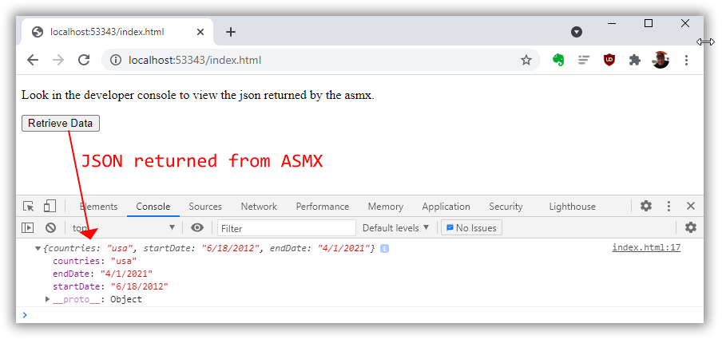

# AsmxReturningJsonDemo
Sample project showing how JSON can be returned from old school ASMX web service.

Run the project and navigate to http://localhost:53343/index.html (your port might be different).  Open developer console, click the Retrieve Data button.  View JSON returned from ASMX in the console:

